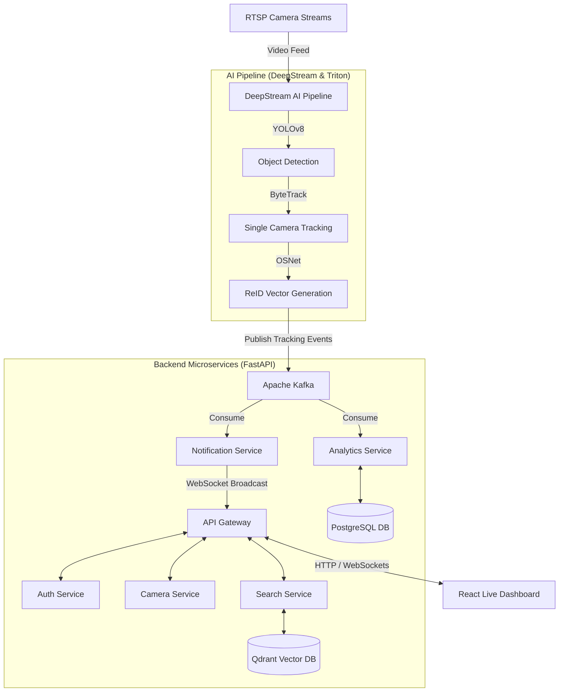

# 🎯 Intelligent Multi-Camera Person Tracking & Video Search System

Hệ thống giám sát và truy vết đối tượng đa camera thời gian thực (Multi-Camera Person Tracking - MCPT) hiệu năng cao. Dự án kết hợp công nghệ xử lý luồng video **NVIDIA DeepStream**, cơ sở dữ liệu vector **Qdrant** phục vụ nhận diện ReID, hệ thống tin nhắn **Apache Kafka**, và giao diện điều khiển live dashboard hiện đại bằng **React & TypeScript**.

---

## 📖 Mục Lục (Table of Contents)
1. [Kiến Trúc Hệ Thống (Architecture Overview)](#-kiến-trúc-hệ-thống-architecture-overview)
2. [Chi Tiết Công Nghệ Sử Dụng (Detailed Tech Stack)](#-chi-tiết-công-nghệ-sử-dụng-detailed-tech-stack)
3. [Cấu Trúc Dự Án Monorepo (Project Structure)](#-cấu-trúc-dự-án-monorepo-project-structure)
4. [Phân Tích Chi Tiết Các Luồng Hoạt Động (Detailed Core Flows)](#-phân-tích-chi-tiết-các-luồng-hoạt-động-detailed-core-flows)
5. [Hướng Dẫn Chạy Dự Án (How to Run)](#-hướng-dẫn-chạy-dự-án-how-to-run)
6. [Hệ Thống Kiểm Thử Toàn Diện (Testing Suite)](#-hệ-thống-kiểm-thử-toàn-diện-testing-suite)

---

## 🏗️ Kiến Trúc Hệ Thống (Architecture Overview)

Hệ thống được thiết kế theo kiến trúc **Event-Driven Microservices** phi tập trung, đảm bảo tính sẵn sàng cao, khả năng mở rộng (scale) độc lập:



---

## 🛠️ Chi Tiết Công Nghệ Sử Dụng (Detailed Tech Stack)

Dự án áp dụng các giải pháp công nghệ tiên tiến nhất trong xử lý AI, truyền thông điệp hướng sự kiện và cơ sở dữ liệu quy mô lớn:

### 1. Phân Tích Video & Suy Luận AI (AI Inference Pipeline)
*   **NVIDIA DeepStream SDK 7.x**: Framework cốt lõi tối ưu hóa phần cứng GPU để giải mã video (NVDEC), xử lý buffer bộ nhớ đồ họa (NVMM) và ghép các plugin suy luận thành một đường ống xử lý trơn tru không bị nghẽn I/O.
*   **NVIDIA Triton Inference Server**: Máy chủ suy luận phân tán, quản lý tải mô hình YOLOv8 và OSNet trên nhiều GPU, hỗ trợ tối ưu hóa dynamic batching và TensorRT.
*   **YOLOv8 (TensorRT FP16/INT8 optimized)**: Thực hiện nhận diện người (`Person Detection`) và nhận diện hỏa hoạn (`Fire Detection`) trực tiếp trên luồng frame giải mã với độ trễ cực thấp.
*   **ByteTrack Tracker**: Theo dõi đối tượng liên tục trong từng camera bằng cách liên kết Bounding Box thông qua bộ lọc Kalman Filter và thuật toán Hungarian Algorithm.
*   **OSNet ReID**: Trích xuất đặc trưng hình ảnh người thành **Vector Embedding 512 chiều**, có khả năng nhận diện chính xác ngoại hình đối tượng ngay cả khi thay đổi góc quay camera, ánh sáng hoặc bị che khuất một phần.

### 2. Dịch Vụ Backend & Monorepo (Backend Frameworks)
*   **Python 3.11+ & FastAPI**: ASGI framework bất đồng bộ (async/await) phục vụ toàn bộ API Gateway và microservices. Đạt hiệu năng chịu tải cao, tích hợp chuẩn OpenAPI / Swagger tự động.
*   **Pydantic v2**: Xác thực và ràng buộc dữ liệu nghiêm ngặt ở đầu vào/đầu ra của tất cả các luồng API, chống lỗi định dạng dữ liệu trong quá trình trao đổi giữa các dịch vụ.
*   **SQLAlchemy 2.0 Async & asyncpg**: Thư viện ORM hiện đại, thực hiện truy vấn PostgreSQL bất đồng bộ hoàn toàn, tránh blocking luồng chính của FastAPI khi xử lý dữ liệu lớn.

### 3. Lưu Trữ Dữ Liệu & Tìm Kiếm Vector (Databases)
*   **Qdrant Vector Database**: Cơ sở dữ liệu chuyên biệt để lưu trữ đặc trưng vector ReID (512-dim). Cấu hình chỉ mục **HNSW (Hierarchical Navigable Small World)** và khoảng cách Cosine giúp tìm kiếm tương đồng vector đạt thông lượng **> 4.000 QPS** với độ trễ chỉ vài mili-giây.
*   **PostgreSQL 16**: Lưu trữ thông tin camera, nhật ký di chuyển (telemetry point), và các cấu hình nghiệp vụ. Dữ liệu telemetry được tối ưu hóa chỉ mục **B-Tree** trên cặp khóa ngoại giúp truy vấn lịch sử nhanh gấp **1.000+ lần** so với truy vấn tuần tự.
*   **Redis 7**: Cache trung gian, quản lý phiên làm việc JWT và lưu trạng thái bật/tắt của luồng camera.

### 4. Truyền Bản Tin Sự Kiện & Real-time (Streaming & Message Broker)
*   **Apache Kafka**: Đóng vai trò là hệ thống xương sống (Event Backbone). DeepStream AI pipeline đóng vai trò là **Producer** gửi bản tin tọa độ và vector liên tục; các microservices đóng vai trò là **Consumers** tiêu thụ độc lập mà không làm giảm hiệu năng của nhau.
*   **WebSockets**: Kênh truyền thông tin hai chiều thời gian thực giữa API Gateway và React Dashboard, đảm bảo hiển thị tọa độ bbox và các cảnh báo khẩn cấp ngay lập tức.

### 5. Giám Sát & Vận Hành (Observability & DevOps)
*   **Prometheus & Grafana**: Thu thập metrics (CPU, RAM, GPU, Kafka lag, API Latency) và trực quan hóa lên các Dashboard giám sát hệ thống.
*   **Grafana Loki & Tempo**: Quản lý tập trung logs của các container, kết hợp **Distributed Tracing (Tempo)** để theo dõi đường đi của một request/sự kiện qua từng microservice bằng duy nhất một `Trace ID`.
*   **Kubernetes (K8s)**: Các tài nguyên triển khai được cấu hình bằng YAML manifest với Kustomize, hỗ trợ mở rộng quy mô pod tự động theo CPU/RAM (HPA).

---

## 📁 Cấu Trúc Dự Án Monorepo (Project Structure)

Thư mục dự án được tổ chức theo mô hình **Monorepo** phân chia rõ ràng giữa các Dịch vụ (Apps) và Thư viện dùng chung (Packages):

```plaintext
├── apps/                                   # Các dịch vụ độc lập (Microservices & Web)
│   ├── ai-service/                         # Dịch vụ AI tích hợp DeepStream & Triton
│   ├── analytics-service/                  # Xử lý phân tích dữ liệu di chuyển, dwell time
│   ├── auth-service/                       # Quản lý định danh, xác thực và cấp phát JWT
│   ├── camera-service/                     # Quản lý CRUD camera và upload video thử nghiệm
│   ├── gateway/                            # API Gateway định tuyến và WebSocket Hub
│   ├── notification-service/               # Lắng nghe sự kiện cháy/đột nhập và gửi cảnh báo
│   ├── scheduler-service/                  # Lịch trình tác vụ nền và dọn dẹp hệ thống
│   ├── search-service/                     # Tìm kiếm truy vết đặc trưng ReID vector
│   └── web/                                # React (Vite, TypeScript, Zustand) Dashboard
│
├── packages/                               # Các thư viện dùng chung trong Monorepo
│   ├── domain/                             # Thực thể và logic miền (Alert, Camera, Person)
│   ├── contracts/                          # Định nghĩa DTO và hợp đồng dữ liệu dùng chung
│   ├── shared/                             # Cấu hình DB, Kafka client, security middleware
│   └── testing/                            # Tiện ích hỗ trợ mock dữ liệu kiểm thử
│
├── database/                               # Cơ sở dữ liệu và cấu hình khởi tạo
│   ├── postgres/                           # Script khởi tạo migrations DB quan hệ
│   └── qdrant/                             # Script khởi tạo collection vector embeddings
│
├── infrastructure/                         # Cấu hình vận hành và triển khai
│   ├── kubernetes/                         # Triển khai Kubernetes (Base & Kustomize Overlays)
│   └── nginx/                              # Cấu hình proxy định tuyến ngược
│
├── monitoring/                             # Hệ thống giám sát toàn diện
│   ├── prometheus/                         # Prometheus Alert rules & targets config
│   ├── alertmanager/                       # Cảnh báo kênh Slack, Webhook, Email
│   ├── loki/                               # Quản lý tập trung logs của các dịch vụ
│   ├── tempo/                              # Distributed tracing (Tracer ID)
│   └── grafana/                            # Grafana datasources & dashboards JSON
│
└── tests/                                  # Bộ suite kiểm thử toàn diện
    ├── unit/                               # Unit test domain entities & API schemas
    ├── integration/                        # Kiểm thử tích hợp Kafka, Analytics, DB pipelines
    ├── e2e/                                # Kiểm thử luồng hoạt động đầu-cuối
    ├── load/                               # Locust load test API Gateway
    └── stress/                             # Kiểm thử chịu tải GPU Model & Stream
```

---

## 🔄 Phân Tích Chi Tiết Các Luồng Hoạt Động (Detailed Core Flows)

### Luồng 1: Real-time Camera Ingestion & AI Pipeline (Nhận Luồng & Phân Tích AI)
```
[Camera RTSP] 
      │ (Luồng H.264/H.265)
      ▼
[GStreamer / DeepStream Decode (NVDEC)] 
      │ (Bộ nhớ đồ họa GPU - NVMM)
      ▼
[YOLOv8 Person Detection (PGIE)] ───► Sinh tọa độ Bounding Box (x, y, w, h)
      │
      ▼
[ByteTrack Multi-Object Tracking] ──► Gán Tracking ID tạm thời cho mỗi camera
      │
      ▼
[OSNet ReID Vector Generation (SGIE)] ──► Trích xuất Crop người -> Sinh Vector 512 chiều
      │
      ▼
[Gst-nvmsgbroker] ───► Gửi JSON Event qua Kafka (topic: tracking-events)
```
*   **Mô tả chi tiết**: Từng frame từ camera RTSP được giải mã trực tiếp trên chip cứng của GPU để hạn chế nghẽn bus CPU. YOLOv8 quét hình ảnh để tìm kiếm người và lửa. ByteTrack liên kết tọa độ của các frame liên tục để giữ ID cho đối tượng trong phạm vi camera đó. Khi đối tượng di chuyển ổn định, OSNet cắt vùng ảnh của người đó, chuyển thành một mảng vector 512 chiều mô tả đặc trưng ngoại hình và đẩy lên Kafka dưới dạng gói tin JSON.

---

### Luồng 2: Real-time Event Streaming & Orchestration (Điều Phối Tin Nhắn)
```
[Kafka Broker] 
      │ 
      ├──► [Analytics Service Consumer] 
      │         │
      │         ▼ Tính toán tọa độ -> Ghi lịch sử di chuyển -> [PostgreSQL]
      │
      └──► [Notification Service Consumer]
                │
                ▼ So khớp quy tắc cảnh báo (Vùng cấm, Phát hiện cháy)
                │
                ▼ (Nếu vi phạm)
          [Gửi tín hiệu khẩn cấp] ──► [API Gateway via WebSocket] ──► [React UI Alert Board]
```
*   **Mô tả chi tiết**: Kafka tiếp nhận luồng sự kiện tốc độ cao từ AI Pipeline và phân phối tới các dịch vụ tiêu thụ độc lập:
    *   **Analytics Service**: Lọc tin nhắn, tính toán các chỉ số di chuyển (tọa độ trung tâm, hướng di chuyển) và lưu nhật ký vào PostgreSQL.
    *   **Notification Service**: So sánh tọa độ của đối tượng với các đa giác định nghĩa "vùng cấm" (Cấu hình trong DB). Nếu phát hiện vi phạm hoặc phát hiện sự kiện cháy, hệ thống lập tức đóng gói thông tin cảnh báo gửi tới API Gateway qua gRPC/HTTP để phát sóng tức thời qua WebSocket tới trình duyệt của người quản lý.

---

### Luồng 3: Tìm Kiếm Người & Truy Vết Đa Camera (Person Search & ReID)
```
[Người Dùng Upload Ảnh] ──► [React Dashboard] ──► [API Gateway]
                                                      │
                                                      ▼
                                              [Search Service]
                                                      │
                                                      ├─► Đẩy ảnh qua [ai-service] để tạo ReID Vector
                                                      │
                                                      ├─► Tìm kiếm khoảng cách Cosine trên [Qdrant]
                                                      │   (Lấy ra Person ID khớp nhất, score >= 0.50)
                                                      │
                                                      └─► Lấy lịch sử tọa độ Person ID từ [PostgreSQL]
                                                              │
                                                              ▼
                                              [Dựng Bản Đồ Hành Trình] (UI)
```
*   **Mô tả chi tiết**: Khi cần tìm kiếm một người mất tích hoặc đối tượng khả nghi:
    1.  Người dùng tải lên một hình ảnh chân dung trên React UI.
    2.  `Search Service` tiếp nhận ảnh, gửi sang `ai-service` để trích xuất đặc trưng ngoại hình thành vector 512 chiều.
    3.  Thực hiện tìm kiếm k-NN tương đồng trên `Qdrant` sử dụng chỉ mục HNSW. Qdrant trả về danh sách các sự kiện chứa vector tương đồng lớn nhất kèm chỉ số tương đồng (Similarity Score).
    4.  Từ danh sách kết quả, hệ thống truy xuất các bản ghi thời gian và camera tương ứng trong `PostgreSQL` để kết nối các điểm xuất hiện của người đó thành một bản đồ hành trình liền mạch theo trình tự thời gian.

---

### Luồng 4: Upload Video Thử Nghiệm (Video Test Pipeline)
```
[Upload Video File] ──► [React UI] ──► [API Gateway] ──► [Camera Service]
                                                              │
                                                              ▼
                                                        [Lưu file video]
                                                              │
                                                              ▼
                                                   [Giả lập RTSP Stream]
                                                              │
                                                              ▼
                                                    [DeepStream Pipeline]
```
*   **Mô tả chi tiết**: Để kiểm tra hệ thống mà không cần camera vật lý:
    1.  Người dùng tải lên tệp video (`.mp4`, `.avi`) thông qua giao diện.
    2.  `Camera Service` kiểm tra định dạng, lưu trữ tệp tin vào thư mục tạm thời.
    3.  Một luồng stream ảo (Virtual RTSP Loop hoặc GStreamer Pipeline) được khởi tạo để đọc video này lặp đi lặp lại.
    4.  Luồng stream ảo được đăng ký vào cấu hình camera ảo của hệ thống, dẫn trực tiếp vào `DeepStream AI Pipeline` giống như một camera RTSP thông thường để thực hiện phân tích kiểm thử.

---

## 🚀 Hướng Dẫn Chạy Dự Án (How to Run)

### 📋 Yêu Cầu Hệ Thống
*   Hệ điều hành: Ubuntu 22.04+ (Khuyên dùng để tối ưu DeepStream) hoặc Windows 11.
*   **NVIDIA GPU** dòng Pascal trở lên với Drivers phiên bản `535+` và **NVIDIA Container Toolkit** đã được cài đặt (nếu chạy AI pipeline).
*   Docker & Docker Compose v2+.
*   Python 3.11+ & Node.js 20+.

### ⚙️ Cài Đặt Môi Trường Phát Triển (Local Setup)

1.  **Clone mã nguồn và cấu hình biến môi trường**:
    ```bash
    git clone https://github.com/dungvu242k3/Intelligent-Multi-Camera-Person-Tracking-Video-Search-System.git
    cd Intelligent-Multi-Camera-Person-Tracking-Video-Search-System
    cp .env.example .env
    ```

2.  **Khởi tạo Virtual Environment cho Python**:
    ```bash
    python -m venv .venv
    # Windows:
    .\.venv\Scripts\activate
    # Linux/macOS:
    source .venv/bin/activate
    
    # Cài đặt toàn bộ dependencies phát triển và kiểm thử:
    pip install -r requirements.txt
    ```

3.  **Khởi chạy cơ sở hạ tầng (PostgreSQL, Qdrant, Redis, Kafka, MinIO, Prometheus, Grafana)**:
    ```bash
    docker-compose up -d postgres qdrant redis kafka minio prometheus grafana loki tempo
    ```

4.  **Khởi tạo cấu hình Collection Qdrant**:
    ```bash
    python database/qdrant/init_collections.py
    ```

5.  **Chạy các dịch vụ Backend bằng FastAPI**:
    Ví dụ, chạy API Gateway:
    ```bash
    python apps/gateway/src/main.py
    ```

6.  **Khởi chạy Frontend React**:
    ```bash
    cd apps/web
    npm install
    npm run dev
    ```

---

## 🧪 Hệ Thống Kiểm Thử Toàn Diện (Testing Suite)

Dự án tích hợp bộ kiểm thử đầy đủ từ kiểm thử đơn vị, tích hợp cho đến kiểm thử chịu tải hệ thống:

*   **Chạy toàn bộ Unit Tests** (Kiểm thử thực thể domain & logic API):
    ```bash
    pytest tests/unit/ -v
    ```
*   **Chạy toàn bộ Integration Tests** (Kiểm thử liên kết Kafka, Analytics, DB Pipelines):
    ```bash
    # Đặt no_proxy rỗng để tránh xung đột phân tích URL cục bộ của httpx
    $env:no_proxy=""
    pytest tests/integration/ -v
    ```
*   **Chạy toàn bộ End-to-End (E2E) Tests** (Kiểm thử toàn bộ luồng nghiệp vụ thực tế):
    ```bash
    pytest tests/e2e/ -v
    ```
*   **Chạy kiểm thử chịu tải APIs (Locust)**:
    ```bash
    python tests/load/locustfile.py --run-standalone
    ```
*   **Chạy kiểm thử chịu tải mô hình AI (FPS & VRAM)**:
    ```bash
    python tests/stress/stress_gpu_models.py --batch-size 4 --iterations 50
    ```
