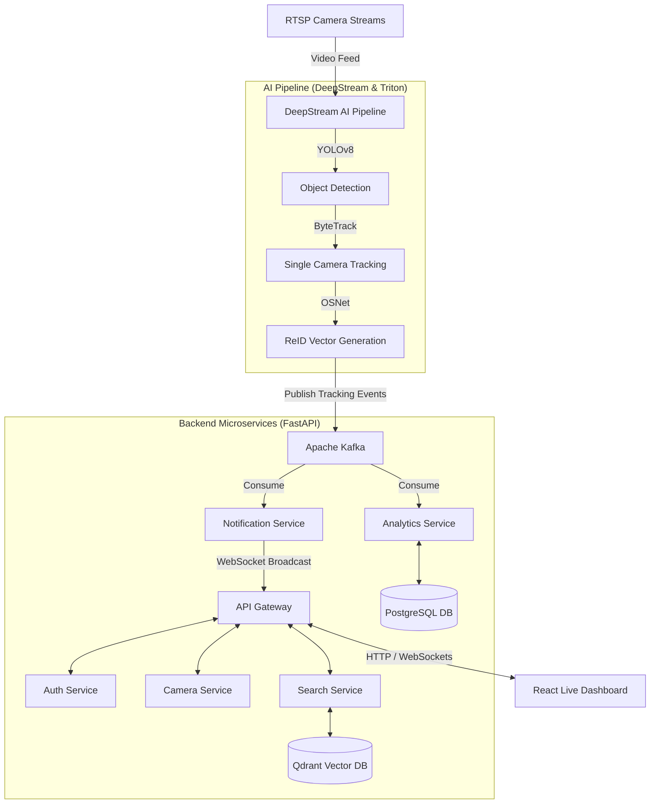

# 🎯 Intelligent Multi-Camera Person Tracking & Video Search System

Hệ thống giám sát và truy vết đối tượng đa camera thời gian thực (Multi-Camera Person Tracking - MCPT) hiệu năng cao. Dự án kết hợp công nghệ xử lý luồng video **NVIDIA DeepStream**, cơ sở dữ liệu vector **Qdrant** phục vụ nhận diện ReID, hệ thống tin nhắn **Apache Kafka**, và giao diện điều khiển live dashboard hiện đại bằng **React & TypeScript**.

---

## 🏗️ Kiến Trúc Hệ Thống (Architecture Overview)

Hệ thống được thiết kế theo kiến trúc **Event-Driven Microservices** phi tập trung, đảm bảo tính sẵn sàng cao, khả năng mở rộng (scale) độc lập:



---

## 📁 Cấu Trúc Dự Án (Project Structure)

Thư mục dự án được tổ chức theo mô hình **Monorepo** phân chia rõ ràng giữa các Dịch vụ (Apps) và Thư viện dùng chung (Packages):

```plaintext
├── apps/                                   # Các dịch vụ độc lập (Microservices & Web)
│   ├── ai-service/                         # Dịch vụ AI tích hợp DeepStream & Triton
│   ├── analytics-service/                  # Xử lý phân tích dữ liệu di chuyển, dwell time
│   ├── auth-service/                       # Quản lý định danh, xác thực và cấp phát JWT
│   ├── camera-service/                     # Quản lý CRUD camera và upload video thử nghiệm
│   ├── gateway/                            # API Gateway định tuyến và WebSocket Hub
│   ├── notification-service/               # Lắng nghe sự kiện cháy/đột nhập và gửi cảnh báo
│   ├── scheduler-service/                  # Lịch trình tác vụ nền và dọn dẹp hệ thống
│   ├── search-service/                     # Tìm kiếm truy vết đặc trưng ReID vector
│   └── web/                                # React (Vite, TypeScript, Zustand) Dashboard
│
├── packages/                               # Các thư viện dùng chung trong Monorepo
│   ├── domain/                             # Thực thể và logic miền (Alert, Camera, Person)
│   ├── contracts/                          # Định nghĩa DTO và hợp đồng dữ liệu dùng chung
│   ├── shared/                             # Cấu hình DB, Kafka client, security middleware
│   └── testing/                            # Tiện ích hỗ trợ mock dữ liệu kiểm thử
│
├── database/                               # Cơ sở dữ liệu và cấu hình khởi tạo
│   ├── postgres/                           # Script khởi tạo migrations DB quan hệ
│   └── qdrant/                             # Script khởi tạo collection vector embeddings
│
├── infrastructure/                         # Cấu hình vận hành và triển khai
│   ├── kubernetes/                         # Triển khai Kubernetes (Base & Kustomize Overlays)
│   └── nginx/                              # Cấu hình proxy định tuyến ngược
│
├── monitoring/                             # Hệ thống giám sát toàn diện
│   ├── prometheus/                         # Prometheus Alert rules & targets config
│   ├── alertmanager/                       # Cảnh báo kênh Slack, Webhook, Email
│   ├── loki/                               # Quản lý tập trung logs của các dịch vụ
│   ├── tempo/                              # Distributed tracing (Tracer ID)
│   └── grafana/                            # Grafana datasources & dashboards JSON
│
└── tests/                                  # Bộ suite kiểm thử toàn diện
    ├── unit/                               # Unit test domain entities & API schemas
    ├── integration/                        # Kiểm thử tích hợp Kafka, Analytics, DB pipelines
    ├── e2e/                                # Kiểm thử luồng hoạt động đầu-cuối
    ├── load/                               # Locust load test API Gateway
    └── stress/                             # Kiểm thử chịu tải GPU Model & Stream
```

---

## 🔄 Các Luồng Hoạt Động Chính (Main Core Flows)

### 1. Luồng Phát Hiện & Nhận Diện Đối Tượng (AI Pipeline to Dashboard)
1. Các camera RTSP đẩy luồng video vào **DeepStream AI Pipeline**.
2. **YOLOv8** phát hiện người/vật thể -> **ByteTrack** gán ID nội bộ camera -> **OSNet** trích xuất đặc trưng ReID thành **vector 512 chiều**.
3. Sự kiện tracking được đẩy vào topic `tracking-events` trên **Kafka**.
4. **Analytics Service** nhận sự kiện, lưu trữ tọa độ di chuyển vào **PostgreSQL**.
5. **Search Service** đối chiếu vector ReID với cơ sở dữ liệu **Qdrant** để gán ID người dùng lịch sử thống nhất.
6. **Notification Service** kiểm tra sự kiện cảnh báo (lửa, đột nhập), đẩy qua **API Gateway WebSocket** hiển thị live lên **React Dashboard** của điều hành viên với độ trễ `< 500ms`.

### 2. Luồng Tìm Kiếm Hình Ảnh (Video Search Flow)
1. Điều hành viên tải lên một ảnh chân dung đối tượng cần tìm kiếm trên **React UI**.
2. API Gateway chuyển yêu cầu tới **Search Service**.
3. Ảnh được chuyển thành ReID vector 512 chiều thông qua **ai-service**.
4. Tìm kiếm Cosine Similarity trên **Qdrant Vector DB** với threshold tối thiểu `0.50`.
5. Trích xuất lịch sử di chuyển của đối tượng trong **PostgreSQL** để dựng bản đồ hành trình qua các camera theo trình tự thời gian (Chronological Trail Point Map).

---

## 🚀 Hướng Dẫn Chạy Dự Án (How to Run)

### 📋 Yêu Cầu Hệ Thống
*   Hệ điều hành: Ubuntu 22.04+ (Khuyên dùng để tối ưu DeepStream) hoặc Windows 11.
*   **NVIDIA GPU** dòng Pascal trở lên với Drivers phiên bản `535+` và **NVIDIA Container Toolkit** đã được cài đặt (nếu chạy AI pipeline).
*   Docker & Docker Compose v2+.
*   Python 3.11+ & Node.js 20+.

### ⚙️ Cài Đặt Môi Trường Phát Triển (Local Setup)

1.  **Clone mã nguồn và cấu hình biến môi trường**:
    ```bash
    git clone https://github.com/dungvu242k3/Intelligent-Multi-Camera-Person-Tracking-Video-Search-System.git
    cd Intelligent-Multi-Camera-Person-Tracking-Video-Search-System
    cp .env.example .env
    ```

2.  **Khởi tạo Virtual Environment cho Python**:
    ```bash
    python -m venv .venv
    # Windows:
    .\.venv\Scripts\activate
    # Linux/macOS:
    source .venv/bin/activate
    
    # Cài đặt toàn bộ dependencies phát triển và kiểm thử:
    pip install -r requirements.txt
    ```

3.  **Khởi chạy cơ sở hạ tầng (PostgreSQL, Qdrant, Redis, Kafka, MinIO, Prometheus, Grafana)**:
    ```bash
    docker-compose up -d postgres qdrant redis kafka minio prometheus grafana loki tempo
    ```

4.  **Khởi tạo cấu hình Collection Qdrant**:
    ```bash
    python database/qdrant/init_collections.py
    ```

5.  **Chạy các dịch vụ Backend bằng FastAPI**:
    Ví dụ, chạy API Gateway:
    ```bash
    python apps/gateway/src/main.py
    ```

6.  **Khởi chạy Frontend React**:
    ```bash
    cd apps/web
    npm install
    npm run dev
    ```

---

## 🧪 Chạy Bộ Kiểm Thử (Testing)

Dự án cung cấp hệ thống kiểm thử toàn diện từ Unit Test đến Load/Stress Test. Để chạy kiểm thử trong môi trường độc lập monorepo:

*   **Chạy toàn bộ Unit Tests**:
    ```bash
    pytest tests/unit/ -v
    ```
*   **Chạy toàn bộ Integration Tests**:
    ```bash
    # Đặt no_proxy rỗng để tránh xung đột phân tích URL cục bộ của httpx
    $env:no_proxy=""
    pytest tests/integration/ -v
    ```
*   **Chạy toàn bộ End-to-End (E2E) Tests**:
    ```bash
    pytest tests/e2e/ -v
    ```
*   **Chạy kiểm thử chịu tải APIs (Locust)**:
    ```bash
    python tests/load/locustfile.py --run-standalone
    ```
*   **Chạy kiểm thử chịu tải mô hình AI (FPS & VRAM)**:
    ```bash
    python tests/stress/stress_gpu_models.py --batch-size 4 --iterations 50
    ```
