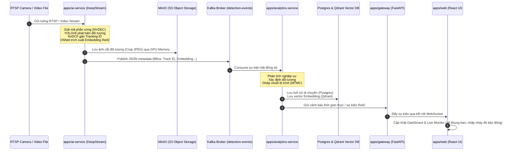

# 📐 Tổng Quan Kiến Trúc & Luồng Hoạt Động MCPT

Hệ thống **Multi-Camera Person Tracking (MCPT)** được thiết kế theo mô hình **Event-Driven Microservices (Kiến trúc hướng sự kiện)** kết hợp với **Clean Architecture** (dành cho phần nghiệp vụ) để xử lý lượng dữ liệu video thời gian thực lớn từ nhiều camera khác nhau một cách tối ưu.

---

## 1. Các thành phần đã được xây dựng trong Monorepo

Dự án được tổ chức dưới dạng **Monorepo** phân chia rõ ràng trách nhiệm của từng thành phần:

*   **`apps/web` (React Frontend)**: Giao diện người dùng sử dụng React 18, Vite, Zustand (quản lý state client) và TanStack Query (quản lý state server). Chứa các tính năng: Dashboard (thống kê), Live Monitor (giám sát đa luồng thời gian thực kèm khung bao đối tượng), Person Search (tìm kiếm đối tượng bằng hình ảnh) và Camera Management.
*   **`apps/gateway` (API Gateway)**: Điểm tiếp nhận duy nhất từ Web Client viết bằng FastAPI. Xử lý định tuyến (proxy), xác thực (JWT), giới hạn tần suất gọi (rate limiting) và trung tâm kết nối WebSocket thời gian thực.
*   **`apps/ai-service` (AI Pipeline)**: Trái tim xử lý AI viết trên nền **NVIDIA DeepStream 7.x + GStreamer**. Nó chịu trách nhiệm giải mã video phần cứng, chạy mô hình phát hiện YOLOv8, theo dõi đối tượng cục bộ bằng NvDCF và trích xuất vector đặc trưng ReID (512 chiều) cho người.
*   **`apps/analytics-service` (Analytics Core)**: Dịch vụ nghiệp vụ chính được viết theo **Clean Architecture (Domain-Driven Design)**. Nó lắng nghe (consume) dữ liệu từ Kafka, tính toán lộ trình đối tượng, lưu dữ liệu lịch sử vào PostgreSQL và đẩy dữ liệu vector/nhận dạng vào cơ sở dữ liệu vector Qdrant.
*   **`apps/camera-service`**: Quản lý thông tin máy quay (Camera CRUD), phân nhóm camera và kiểm tra trạng thái hoạt động (RTSP health check).
*   **`apps/search-service`**: Cung cấp API tìm kiếm đối tượng người qua đặc trưng vector (Vector Search) bằng cách truy vấn Qdrant DB.
*   **`packages/` (Shared Libraries)**: Thư viện mã nguồn dùng chung giữa các microservice (quản lý Kafka, MinIO, logger cấu trúc, định nghĩa DTOs/sự kiện dùng chung).

---

## 2. Luồng hoạt động của hệ thống (End-to-End Workflow)

Luồng xử lý dữ liệu được thiết kế bất đồng bộ hoàn toàn thông qua hàng đợi thông điệp Kafka để tránh nghẽn luồng xử lý AI:



---

## 3. Ví dụ hoạt động thực tế chi tiết

Dưới đây là một kịch bản giả lập cụ thể để minh họa cách hệ thống xử lý thông tin từ đầu vào đến đầu ra:

### Kịch bản giả lập:
> Có **2 camera** hoạt động: **Camera 1** (Cửa ra vào) và **Camera 2** (Kho hàng).
> Một người lạ đeo ba lô đi vào qua cửa ra vào. Sau đó, người này di chuyển đến Kho hàng và vô tình làm phát sinh một đốm lửa nhỏ.

---

### Bước 1: Nhận diện và Xử lý tại Cửa ra vào (Camera 1)
1. **Camera 1** truyền dữ liệu video (RTSP) đến `ai-service`.
2. Hệ thống DeepStream giải mã luồng video, mô hình **YOLOv8** phát hiện 2 đối tượng trong khung hình: `person` (người) và `backpack` (ba lô).
3. **NvDCF Tracker** hoạt động trên Camera 1 gán mã định danh tạm thời: Người này là **Tracking ID: 101**.
4. Vì đối tượng thuộc lớp `person`, mô hình phụ **ReID (OSNet)** lập tức được kích hoạt để trích xuất một vector đặc trưng (Embedding Vector) dài 512 số thực (ký hiệu là **$E_A$**).
5. Bộ cắt ảnh trên GPU lập tức cắt vùng ảnh chứa người và ba lô đó, chuyển thành file ảnh `crop_101.jpg` và đẩy trực tiếp lên **MinIO** lưu trữ.
6. `ai-service` đóng gói thông tin và gửi sự kiện JSON lên **Kafka topic `detection-events`**:
   ```json
   {
     "camera_id": "cam_1",
     "timestamp": "2026-07-16T10:00:00Z",
     "objects": [
       {
         "class_name": "person",
         "track_id": 101,
         "bbox": [100, 150, 250, 450],
         "embedding": [0.015, -0.082, ..., 0.124], 
         "crop_url": "minio://detection-crops/cam_1/crop_101.jpg"
       },
       {
         "class_name": "backpack",
         "track_id": 102,
         "bbox": [120, 180, 180, 260]
       }
     ]
   }
   ```

---

### Bước 2: Phân tích nghiệp vụ tại Analytics Service (Camera 1)
1. `analytics-service` tiêu thụ sự kiện từ Kafka.
2. Hệ thống tiến hành ghi nhận vào **PostgreSQL**: Tạo bản ghi theo dõi cho `Tracking ID: 101` xuất hiện tại `Camera 1` vào lúc `10:00:00`.
3. Đồng thời, hệ thống ghi vector đặc trưng **$E_A$** vào **Qdrant Vector Database** cùng payload kèm theo: `{"camera_id": "cam_1", "timestamp": "2026-07-16T10:00:00Z", "crop_url": "..."}`.
4. Thông tin hiển thị ngay trên màn hình Live Monitor của người giám sát: Hiện khung bao xanh quanh người và ba lô tại ô màn hình Camera 1.

---

### Bước 3: Di chuyển sang Kho hàng và sự cố (Camera 2)
1. Người này di chuyển qua khu vực khuất và đi vào vùng quét của **Camera 2** (Kho hàng) lúc **10:05:00**.
2. Đồng thời, do sơ suất, một đốm lửa bùng lên ở góc kho hàng.
3. `ai-service` xử lý luồng của **Camera 2**:
   * **YOLOv8** phát hiện: `person` (người) và `fire` (lửa).
   * **NvDCF Tracker** trên Camera 2 gán mã theo dõi cục bộ cho người này là **Tracking ID: 209** (vì tracker của mỗi camera hoạt động độc lập).
   * **ReID** trích xuất vector đặc trưng mới cho người này, ký hiệu là **$E_B$**.
   * Bộ cắt ảnh GPU lưu ảnh `crop_209.jpg` (ảnh người) và `crop_fire.jpg` (ảnh lửa) lên MinIO.
   * `ai-service` đẩy gói dữ liệu sự kiện tương ứng của Camera 2 lên Kafka.

---

### Bước 4: Liên kết đa camera (MTMC) & Kích hoạt cảnh báo
1. `analytics-service` nhận được gói tin từ Camera 2:
   * **Xử lý sự kiện cháy (`fire`)**: Phát hiện nhãn nguy hiểm `fire`. `analytics-service` lập tức tạo một sự kiện khẩn cấp gửi qua `notification-service`. Dịch vụ này đẩy thông điệp qua WebSocket của `gateway` tới máy Client. Màn hình giám sát lập tức nhấp nháy đỏ báo động: **"CẢNH BÁO CHÁY TẠI KHO HÀNG (CAMERA 2)"**.
   * **Xử lý sự kiện người (`person`)**: Hệ thống lấy vector **$E_B$** vừa nhận được và thực hiện một truy vấn tìm kiếm thực thể tương đồng gần nhất (Vector Search) trên **Qdrant DB** với các vector đã lưu trong vòng 15 phút qua.
   * **Kết quả đối chiếu**: Qdrant tìm thấy vector **$E_A$** (của Camera 1) có độ tương đồng cosine lên tới **92%** (vượt ngưỡng cấu hình 85%).
   * **Kết luận**: Hệ thống xác nhận người mang `Tracking ID: 209` ở Camera 2 chính là người mang `Tracking ID: 101` ở Camera 1.
   * **Cập nhật lộ trình**: Hệ thống tạo bản đồ di chuyển (Trail Map) liên kết của đối tượng: **Cổng vào (Camera 1 - 10:00:00) ──▶ Kho hàng (Camera 2 - 10:05:00)**.

---

### Bước 5: Truy vết của nhân viên an ninh trên Web UI
1. Khi có chuông báo cháy, nhân viên an ninh mở giao diện **Dashboard / Alert Center** của `apps/web`.
2. Họ nhìn thấy bức ảnh cắt đốm lửa và bức ảnh cắt người xuất hiện gần đốm lửa lúc đó (`crop_209.jpg`).
3. Nhân viên an ninh click vào nút **"Truy vết đối tượng" (Trace Path)** của người này.
4. Giao diện gửi request lên `search-service`, dịch vụ này lấy vector của `crop_209.jpg` để tìm kiếm trong lịch sử di chuyển.
5. Hệ thống trả về đầy đủ chuỗi thời gian di chuyển kèm video/hình ảnh liên quan:
   * **10:00:00**: Đối tượng đi qua Cổng chính (Kèm ảnh chụp `crop_101.jpg` đeo ba lô).
   * **10:05:00**: Đối tượng xuất hiện tại Kho hàng (Kèm ảnh chụp `crop_209.jpg`).
6. Nhờ đó, nhân viên an ninh nhanh chóng xác minh được danh tính, hành trình của người có liên quan đến sự cố và xử lý kịp thời.
